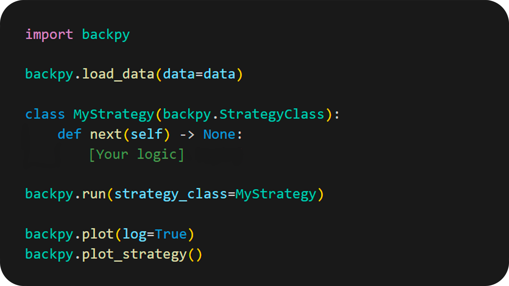

# BackPy
BackPy is a library made in python for back testing in financial markets.
Read Risk_notice.txt and LICENSE.

  #### Version: 0.9.2.032

BackPy is a library that is used to test strategies in the market, 
it is made so that you can provide your own data or use Yfinance module.

## What can I do with BackPy?

- With BackPy you will be able to know the position of different indicators for each point.
- You can create your own indicators based on price, date and volume.
- For each point you can consult previous data such as previous closings and active actions.
- You can display the data with logarithmic scale or not.
- You can print statistics of the uploaded data.

## How to install backpy with pip:

1. Download the latest version from GitHub
- Go to this project GitHub page.
- Look for the "Releases" or "Latest release" section, i recommend versions later than 0.9.2.018.
- Download the ZIP file of the latest version of the project.
2. Unzip the ZIP file
- Unzip the ZIP file you downloaded.
- This will give you a folder containing the project files.
3. Open the terminal
- Open the terminal in your operating system.
- Navigate to the folder you just unzipped. You can use the cd command to change directories.
4. Install the module
- Once you are in the project folder in terminal, run the following command: 'pip install .'.
- This command will install the Python module using the setup.py file located in the project folder.
5. Verify installation
- After the installation process finishes without errors, you can verify if the module has been installed correctly by running some code that imports the newly installed module.
6. Clean downloaded files
- After you have verified that the module is working correctly, you can delete the downloaded ZIP file and unzipped folder if you wish.

### Code example:

