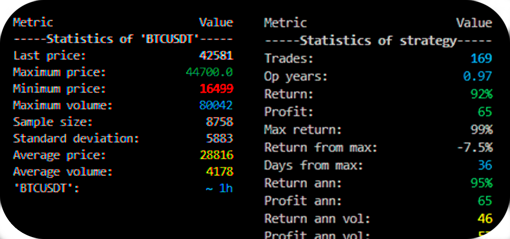

  

# BackPy

**BackPy** is a Python library for backtesting strategies in financial markets.  
You can provide your own historical data or use the built-in integration with the `yfinance` or `binance-connector` modules.

## ⚠️ Important Notices

Please make sure to read the following before using this software:

- [Risk Notice](Risk_notice.txt)
- [License](LICENSE)

By using this software, you acknowledge that you have read and agree to the terms outlined in these documents.

## 📦 How to install backpy with pip

1. Download the latest version from GitHub
- Go to this project GitHub page.
- Download the ZIP file of the latest version of the project.
2. Unzip the ZIP file
- Unzip the ZIP file you downloaded.
- This will give you a folder containing the project files.
3. Open the terminal
- Open the terminal in your operating system.
- Navigate to the folder you just unzipped. You can use the cd command to change directories.
4. Install the module
- Once you are in the project folder in terminal, run the following command: 'pip install .'.
- This command will install the Python module using the setup.py file located in the project folder.
5. Verify installation
- After the installation process finishes without errors, you can verify if the module has been installed correctly by running some code that imports the newly installed module.
6. Clean downloaded files
- After you have verified that the module is working correctly, you can delete the downloaded ZIP file and unzipped folder if you wish.

## 🚀 Code example

With Backpy, you can design your strategies quickly, easily, and in just a few lines.

Don't forget to graph!
Draw any chart and see your strategy inputs and outputs with a single function.

Graph your results, profit equity chart or whatever you want.

Create your custom chart in just a few lines and plot it with a single function.

By the way, don't forget to check the stats in the console.

### Disclaimer
Some images have been edited to highlight specific parts of the code or output, and may not represent the actual output exactly.
Examples shown are for demonstration purposes only. Any strategy used is simplified and should not be considered financial or investment advice.
Also, note that any aspect of the examples may change in future versions.
Always perform your own research and analysis before trading.
